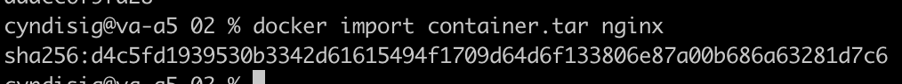

## Part 1. Ready-made docker

* Take the official docker image from nginx and download it using docker pull.

* Check for the docker image with `docker images`

* Run docker image with `docker run -d [image_id|repository]`

* Check that the image is running with `docker ps`

* View container information with `docker inspect [container_id|container_name]`

* From the command output define and write in the report the container size, list of mapped ports and container ip

List of mapped ports and IP adress can be found at the very botom of the inspect list

To ease my burdens i used `grep` command to find the container size

* Stop docker image with `docker stop [container_id|container_name]`

* Check that the image has stopped with `docker ps`

* Run docker with mapped ports 80 and 443 on the local machine with `run` command

to do this we need to run the `docker run -d -p 127.0.0.1:80:80 -p 127.0.0.1:443:443 nginx` command

* Check that the nginx start page is available in the browser at localhost:80

* Restart docker container with `docker restart [container_id|container_name]`

* Check in any way that the container is running

## Part 2. Operations with container

* Read the nginx.conf configuration file inside the docker container with the `exec` command

* Create a nginx.conf file on a local machine

* Configure it on the /status path to return the nginx server status page

* Copy the created nginx.conf file inside the docker image using the `docker cp nginx.conf ddacc6f9fa28:/etc/nginx/conf.d/default.conf` command

* Restart nginx inside the docker image with `docker exec ddacc6f9fa28 nginx -s reload`

* Check that localhost:80/status returns the nginx server status page

* Export the container to a container.tar file with the export command

* Export the container to a container.tar file with the `docker export -o container.tar ddacc6f9fa28` command

* Stop the container using `docker stop ddacc6f9fa28`

* Delete the image with `docker rmi nginx -f` without removing the container first

* Delete stopped container using `docker container rm ddacc6f9fa28`

* Import the container back using the `docker import container.tar nginx` command

* Run the imported container with `docker run -d -p 80:80 -p 443:443 -it nginx bash` command

* Check that localhost:80/status returns the nginx server status page

First we start a server using `exec`

## Part 3. Mini web server

* Wrote a mini server in C and FastCgi that will return a simple page saying Hello World!

* Updated the packages in the container and loaded the fcgi library

* Changed the nginx.conf file

* Launched the written mini server via spawn-fcgi on port 8080

* check with `curl` that everything was done right and also check in localhost

## Part 4. Your own docker

* Build the written docker image with docker build, specifying the name and tag

* Check with docker images that everything is built correctly

* Run the built docker image by mapping port 81 to 80 on the local machine and mapping the ./nginx folder inside the container to the address where the nginx configuration files are located (see Part 2)

* Check that the page of the written mini server is available on localhost:80

* Restart docker image

* Check that localhost:80/status now returns a page with nginx status

## Part 5. Dockle

* Install dockle via brew.

* Install dockle via brew.

* Check the image from the previous task with `dockle hello_world:1.0`

* Fix the image so that there are no errors or warnings when checking with dockle

## Part 6. Basic Docker Compose

* Map port 8080 of the second container to port 80 of the local machine

* Start the docker container from Part 5 (it must work on local network, i.e., you don't need to use EXPOSE instruction and map ports to local machine)

* Start the docker container with nginx which will proxy all requests from port 8080 to port 81 of the first container

* `docker-compose up` command

Checking a localhost and localhost/status

